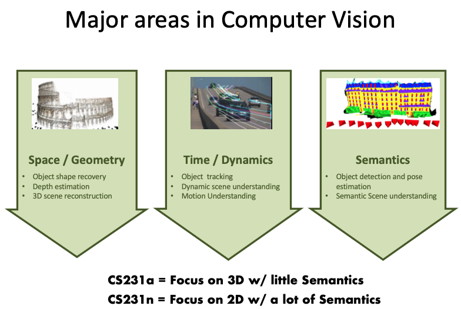

# CS231A_study
## Goal
- preparing project about 3D Perception to 3D Reconstruction and beyond 

## Rules
- notes study [Course Notes](https://web.stanford.edu/class/cs231a/syllabus.html)
- writing code by oneself to derive results

## Reference
[CS231A](https://web.stanford.edu/class/cs231a/syllabus.html)
 

## Progress
### ⛳️ 	Introduction
#### study
- [x] Kim BoHyun
- [ ] Kim MinSol
- [ ] Kang DaeMin
- [ ] Leem ChanHyeok
- [x] Kim SeYeon
- [x] Kim HaNeol

| name | Date | review                                                     | 
| ------ | --------- | ------------------------------------------------------------ |
| Kim BoHyun | 08/24/2024     | [velog](https://velog.io/@boyamie_/cs231a-Introduction)                 |
| Kim MinSol | 08/24/2024     |                 |
| Kang DaeMin | 08/24/2024     |                 |
| Leem ChanHyeok  | 08/24/2024     |                 |
| Kim SeYeon  | 08/24/2024     | [velog](https://velog.io/@yeon-ksy/Camera-Models-1)          |
| Kim HaNeol  | 08/23/2024     | [blog](https://haneol-kijm.github.io/2024/08/22/CS231A-001) |
### 💡 assignment 0
#### Problem Set 0
- [ ] Kim BoHyun
- [ ] Kim MinSol
- [ ] Kang DaeMin
- [ ] Leem ChanHyeok
- [ ] Kim SeYeon
- [x] Kim HaNeol

| name | Date | review                                                     | 
| ------ | --------- | ------------------------------------------------------------ |
| Kim BoHyun | 08/25/2024     | [velog]()                 |
| Kim Minsol | 08/25/2024     |                 |
| Kang DaeMin | 08/25/2024     |                 |
| Leem ChanHyeok  | 08/25/2024     |                 |
| Kim SeYeon  | 08/25/2024     |                 |
| Kim HaNeol  | 08/25/2024     | [sol](https://haneol-kijm.github.io/2024/08/24/CS231A-ps0) [code](https://colab.research.google.com/drive/1uNJOGvm9MaOtz6bN1X3Mnr-KQiNuUKmO?usp=sharing) |

### ⛳️ 	Camera Models (Recorded on Canvas, no in-person class)
#### study [result](https://github.com/boyamie/CS231A_study/blob/main/_posts/2024-08-25-week1.md)
- [x] Kim BoHyun
- [ ] Kim MinSol
- [ ] Kang DaeMin
- [ ] Leem ChanHyeok
- [ ] Kim SeYeon
- [x] Kim HaNeol

| name | Date | review                                                     | 
| ------ | --------- | ------------------------------------------------------------ |
| Kim BoHyun | 08/24/2024     | [velog](https://velog.io/@boyamie_/cs231aCamera-Models)                 |
| Kim MinSol | 08/24/2024     |                 |
| Kang DaeMin | 08/24/2024     |                 |
| Leem ChanHyeok  | 08/24/2024     |                 |
| Kim SeYeon  | 08/24/2024     |                 |
| Kim HaNeol  | 08/23/2024     | [blog](https://haneol-kijm.github.io/2024/08/22/CS231A-002)      |

### 💡 assignment 1
#### Problem Set 1
- [ ] Kim BoHyun
- [ ] Kim MinSol
- [ ] Kang DaeMin
- [ ] Leem ChanHyeok
- [ ] Kim SeYeon
- [x] Kim HaNeol

| name | Date | review                                                     | 
| ------ | --------- | ------------------------------------------------------------ |
| Kim BoHyun | 08/25/2024     | [velog]()                 |
| Kim Minsol | 08/25/2024     |                 |
| Kang DaeMin | 08/25/2024     |                 |
| Leem ChanHyeok  | 08/25/2024     |                 |
| Kim SeYeon  | 08/25/2024     |                 |
| Kim HaNeol  | 08/30/2024     |[sol](https://haneol-kijm.github.io/2024/08/24/CS231A-ps1) [code](https://colab.research.google.com/drive/1BX4pB5GbDv-CknHV5lclWprEuUqf78qG?usp=sharing)|

### ⛳️ Python Introduction and Linear Algebra Review
#### study
- [ ] Kim BoHyun
- [ ] Kim MinSol
- [ ] Kang DaeMin
- [ ] Leem ChanHyeok
- [ ] Kim SeYeon
- [x] Kim HaNeol

| name | Date | review                                                     | 
| ------ | --------- | ------------------------------------------------------------ |
| Kim BoHyun | 08/31/2024     | [velog]()                 |
| Kim MinSol | 08/31/2024     |                 |
| Kang DaeMin | 08/31/2024     |                 |
| Leem ChanHyeok  | 08/31/2024     |                 |
| Kim SeYeon  | 08/31/2024     |                 |
| Kim HaNeol  | 08/23/2024     | skip |

### ⛳️ Camera Models II and Camera Calibration
#### study
- [ ] Kim BoHyun
- [ ] Kim MinSol
- [ ] Kang DaeMin
- [ ] Leem ChanHyeok
- [ ] Kim SeYeon
- [x] Kim Haneol

| name | Date | review                                                     | 
| ------ | --------- | ------------------------------------------------------------ |
| Kim BoHyun | 08/31/2024     | [velog]()                 |
| Kim MinSol | 08/31/2024     |                 |
| Kang DaeMin | 08/31/2024     |                 |
| Leem ChanHyeok  | 08/31/2024     |                 |
| Kim SeYeon  | 08/31/2024     |                 |
| Kim HaNeol  | 08/27/2024     | [blog](https://haneol-kijm.github.io/2024/08/27/CS231A-003) |

### ⛳️ Single View Metrology
#### study
- [ ] Kim BoHyun
- [ ] Kim MinSol
- [ ] Kang DaeMin
- [ ] Leem ChanHyeok
- [ ] Kim SeYeon
- [x] Kim HaNeol

| name | Date | review                                                     | 
| ------ | --------- | ------------------------------------------------------------ |
| Kim BoHyun | 08/31/2024     | [velog]()                 |
| Kim MinSol | 08/31/2024     |                 |
| Kang DaeMin | 08/31/2024     |                 |
| Leem ChanHyeok  | 08/31/2024     |                 |
| Kim SeYeon  | 08/31/2024     |                 |
| Kim HaNeol | 08/28/2024     |  [blog](https://haneol-kijm.github.io/2024/08/28/CS231A-004)          |

### ⛳️ Epipolar Geometry
#### study
- [ ] Kim BoHyun
- [ ] Kim MinSol
- [ ] Kang DaeMin
- [ ] Leem ChanHyeok
- [ ] Kim SeYeon
- [ ] Kim HaNeol

| name | Date | review                                                     | 
| ------ | --------- | ------------------------------------------------------------ |
| Kim BoHyun | 08/31/2024     | [velog]()                 |
| Kim MinSol | 08/31/2024     |                 |
| Kang DaeMin | 08/31/2024     |                 |
| Leem ChanHyeok  | 08/31/2024     |                 |
| Kim SeYeon  | 08/31/2024     |                 |
| Kim HaNeol | 08/29/2024     |  [blog](https://haneol-kijm.github.io/2024/08/29/CS231A-005)         |

### ⛳️ Stereo Systems
#### study
- [ ] Kim BoHyun
- [ ] Kim MinSol
- [ ] Kang DaeMin
- [ ] Leem ChanHyeok
- [ ] Kim SeYeon
- [ ] Kim HaNeol

| name | Date | review                                                     | 
| ------ | --------- | ------------------------------------------------------------ |
| Kim BoHyun | 08/31/2024     | [velog]()                 |
| Kim MinSol | 08/31/2024     |                 |
| Kang DaeMin | 08/31/2024     |                 |
| Leem ChanHyeok  | 08/31/2024     |                 |
| Kim SeYeon  | 08/31/2024     |                 |
| Kim HaNeol | 08/31/2024     |                 |

### 💡 assignment 2
#### Problem Set 2
- [ ] Kim BoHyun
- [ ] Kim MinSol
- [ ] Kang DaeMin
- [ ] Leem ChanHyeok
- [ ] Kim SeYeon
- [ ] Kim HaNeol

| name | Date | review                                                     | 
| ------ | --------- | ------------------------------------------------------------ |
| Kim BoHyun | 09/01/2024     | [velog]()                 |
| Kim MinSol | 09/01/2024     |                 |
| Kang DaeMin | 09/01/2024     |                 |
| Leem ChanHyeok  | 09/01/2024     |                 |
| Kim SeYeon  | 09/01/2024     |                 |
| Kim HaNeol | 09/01/2024     |                 |

### ⛳️ Fitting and Matching
#### study
- [ ] Kim BoHyun
- [ ] Kim MinSol
- [ ] Kang DaeMin
- [ ] Leem ChanHyeok
- [ ] Kim SeYeon
- [ ] Kim HaNeol

| name | Date | review                                                     | 
| ------ | --------- | ------------------------------------------------------------ |
| Kim BoHyun | 09/07/2024     | [velog]()                 |
| Kim MinSol | 09/07/2024     |                 |
| Kang DaeMin | 09/07/2024     |                 |
| Leem ChanHyeok  | 09/07/2024     |                 |
| Kim SeYeon  | 09/07/2024     |                 |
| Kim HaNeol | 09/07/2024     |                 |

### ⛳️ Representations & Representation Learning
#### study
- [ ] Kim BoHyun
- [ ] Kim MinSol
- [ ] Kang DaeMin
- [ ] Leem ChanHyeok
- [ ] Kim SeYeon
- [ ] Kim HaNeol

| name | Date | review                                                     | 
| ------ | --------- | ------------------------------------------------------------ |
| Kim BoHyun | 09/07/2024     | [velog]()                 |
| Kim MinSol | 09/07/2024     |                 |
| Kang DaeMin | 09/07/2024     |                 |
| Leem ChanHyeok  | 09/07/2024     |                 |
| Kim SeYeon  | 09/01/2024     |                 |
| Kim HaNeol | 09/07/2024     |                 |

### 💡 assignment 3
#### Problem Set 3
- [ ] Kim BoHyun
- [ ] Kim MinSol
- [ ] Kang DaeMin
- [ ] Leem ChanHyeok
- [ ] Kim SeYeon
- [ ] Kim HaNeol

| name | Date | review                                                     | 
| ------ | --------- | ------------------------------------------------------------ |
| Kim BoHyun | 09/08/2024     | [velog]()                 |
| Kim MinSol | 09/08/2024     |                 |
| Kang DaeMin | 09/08/2024     |                 |
| Leem ChanHyeok  | 09/08/2024     |                 |
| Kim SeYeon  | 09/08/2024     |                 |
| Kim HaNeol | 09/08/2024     |                 |

### ⛳️ Monocular Depth Estimation & Feature Tracking
#### study
- [ ] Kim BoHyun
- [ ] Kim MinSol
- [ ] Kang DaeMin
- [ ] Leem ChanHyeok
- [ ] Kim SeYeon
- [ ] Kim HaNeol

| name | Date | review                                                     | 
| ------ | --------- | ------------------------------------------------------------ |
| Kim BoHyun | 09/14/2024     | [velog]()                 |
| Kim MinSol | 09/14/2024     |                 |
| Kang DaeMin | 09/14/2024     |                 |
| Leem ChanHyeok  | 09/14/2024     |                 |
| Kim SeYeon  | 09/14/2024     |                 |
| Kim HaNeol | 09/14/2024     |                 |

### ⛳️ Optical and Scene Flow
#### study
- [ ] Kim BoHyun
- [ ] Kim MinSol
- [ ] Kang DaeMin
- [ ] Leem ChanHyeok
- [ ] Kim SeYeon
- [ ] Kim HaNeol

| name | Date | review                                                     | 
| ------ | --------- | ------------------------------------------------------------ |
| Kim BoHyun | 09/14/2024     | [velog]()                 |
| Kim MinSol | 09/14/2024     |                 |
| Kang DaeMin | 09/14/2024     |                 |
| Leem ChanHyeok  | 09/14/2024     |                 |
| Kim SeYeon  | 09/14/2024     |                 |
| Kim HaNeol | 09/14/2024     |                 |

### ⛳️ Optimal Estimation
#### study
- [ ] Kim BoHyun
- [ ] Kim MinSol
- [ ] Kang DaeMin
- [ ] Leem ChanHyeok
- [ ] Kim SeYeon
- [ ] Kim HaNeol

| name | Date | review                                                     | 
| ------ | --------- | ------------------------------------------------------------ |
| Kim BoHyun | 09/14/2024     | [velog]()                 |
| Kim MinSol | 09/14/2024     |                 |
| Kang DaeMin | 09/14/2024     |                 |
| Leem ChanHyeok  | 09/14/2024     |                 |
| Kim SeYeon  | 09/14/2024     |                 |
| Kim HaNeol | 09/14/2024     |                 |

### ⛳️ Optimal Estimation Cont.
#### study
- [ ] Kim BoHyun
- [ ] Kim MinSol
- [ ] Kang DaeMin
- [ ] Leem ChanHyeok
- [ ] Kim SeYeon
- [ ] Kim HaNeol

| name | Date | review                                                     | 
| ------ | --------- | ------------------------------------------------------------ |
| Kim BoHyun | 09/14/2024     | [velog]()                 |
| Kim MinSol | 09/14/2024     |                 |
| Kang DaeMin | 09/14/2024     |                 |
| Leem ChanHyeok  | 09/14/2024     |                 |
| Kim SeYeon  | 09/14/2024     |                 |
| Kim HaNeol | 09/14/2024     |                 |

### 💡 assignment 4
#### Problem Set 4
- [ ] Kim BoHyun
- [ ] Kim MinSol
- [ ] Kang DaeMin
- [ ] Leem ChanHyeok
- [ ] Kim SeYeon
- [ ] Kim HaNeol

| name | Date | review                                                     | 
| ------ | --------- | ------------------------------------------------------------ |
| Kim BoHyun | 09/15/2024     | [velog]()                 |
| Kim MinSol | 09/15/2024     |                 |
| Kang DaeMin | 09/15/2024     |                 |
| Leem ChanHyeok  | 09/15/2024     |                 |
| Kim SeYeon  | 09/15/2024     |                 |
| Kim HaNeol | 09/15/2024     |                 |

### ⛳️ Applications of Optimal Estimation: Object Tracking and Localization
#### study
- [ ] Kim BoHyun
- [ ] Kim MinSol
- [ ] Kang DaeMin
- [ ] Leem ChanHyeok
- [ ] Kim SeYeon
- [ ] Kim HaNeol

| name | Date | review                                                     | 
| ------ | --------- | ------------------------------------------------------------ |
| Kim BoHyun | 09/16/2024     | [velog]()                 |
| Kim MinSol | 09/16/2024     |                 |
| Kang DaeMin | 09/16/2024     |                 |
| Leem ChanHyeok  | 09/16/2024     |                 |
| Kim SeYeon  | 09/16/2024     |                 |
| Kim HaNeol | 09/16/2024     |                 |

### ⛳️ Neural Radiance Fields
- [ ] Kim BoHyun
- [ ] Kim MinSol
- [ ] Kang DaeMin
- [ ] Leem ChanHyeok
- [ ] Kim SeYeon
- [ ] Kim HaNeol

| name | Date | review                                                     | 
| ------ | --------- | ------------------------------------------------------------ |
| Kim BoHyun | 09/16/2024     | [velog]()                 |
| Kim MinSol | 09/16/2024     |                 |
| Kang DaeMin | 09/16/2024     |                 |
| Leem ChanHyeok  | 09/16/2024     |                 |
| Kim SeYeon  | 09/16/2024     |                 |
| Kim HaNeol | 09/16/2024     |                 |

### ⛳️ Gaussian Splatting
- [ ] Kim BoHyun
- [ ] Kim MinSol
- [ ] Kang DaeMin
- [ ] Leem ChanHyeok
- [ ] Kim SeYeon
- [ ] Kim HaNeol

| name | Date | review                                                     | 
| ------ | --------- | ------------------------------------------------------------ |
| Kim BoHyun | 09/16/2024     | [velog]()                 |
| Kim MinSol | 09/16/2024     |                 |
| Kang DaeMin | 09/16/2024     |                 |
| Leem ChanHyeok  | 09/16/2024     |                 |
| Kim SeYeon  | 09/16/2024     |                 |
| Kim HaNeol | 09/16/2024     |                 |
